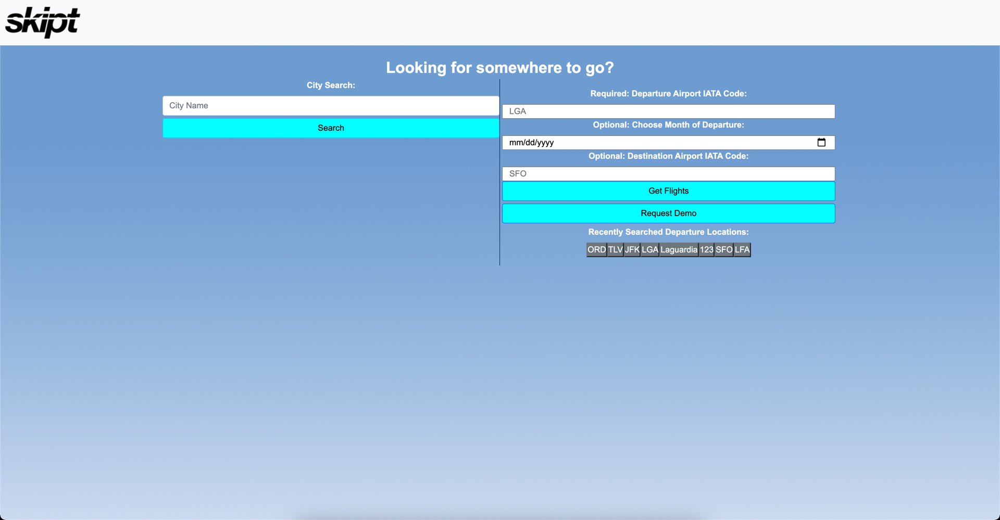

# skipt-clone

## Project purpose

SKIPT was created for the traveler in all of us - and for multiple use cases and personas.

## Deployed App

https://mkohn4.github.io/skipt-clone/

## User Stories

As a WFH Employee, I want to find the cheapest flight options from my home airport, so that I can WFAnywhere on a budget.

As a child who wants to visit their parents, I want to find the cheapest flights between mynhome airport and my parents home airport, so that I can plan out trips to see them and vice versa.

As a vacationer, I want to find the cheapest time to book my vacation, so that I can coordinate the other items

And much much more....

## Screenshot

